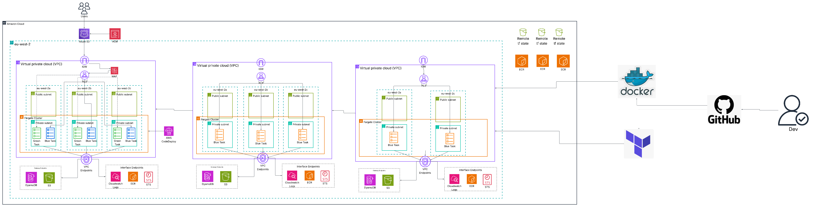
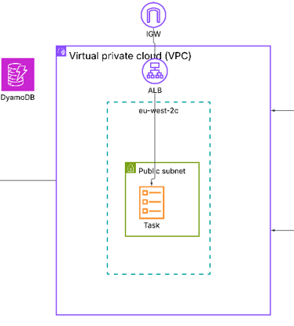
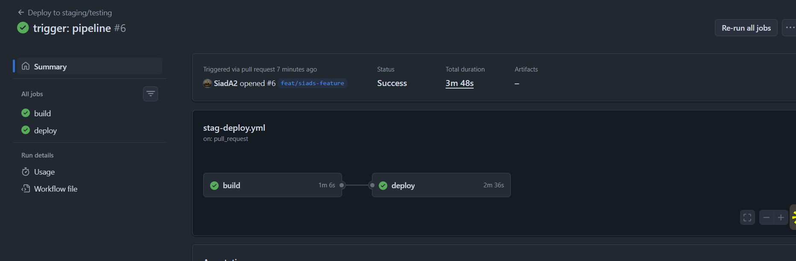
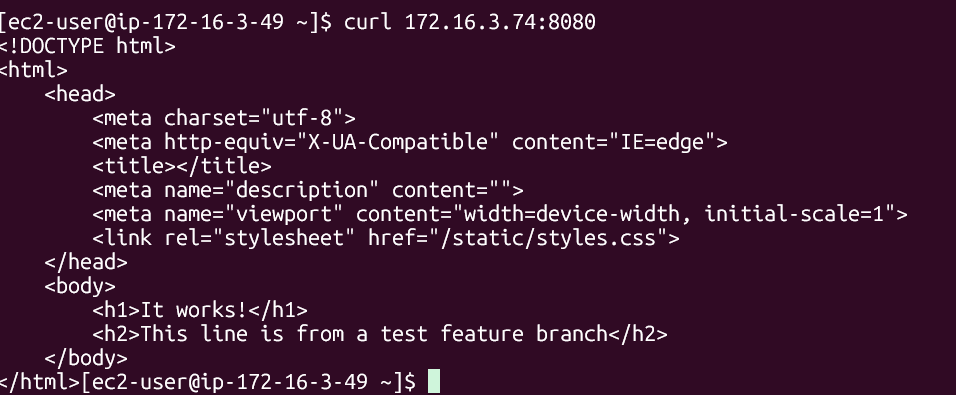
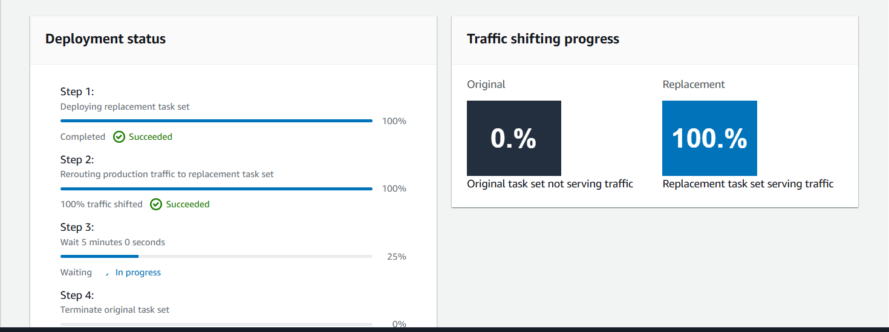

<h1 align="center">ECS URL-Shortener</h1>

<div align="center">


</div>

<div align="center">
    
</div>
 
## Contents

- [Overview](#overview)
- [Key Features](#vision)
- [GitLab Flow](#gitlab-flow)
- [Directory Structure](#directory-structure)


## Overview

This is an end-to-end, multi-cloud deployment of a URL-shortener. This URL-shortener takes a long url, shortens it and stores the shortened url in DynamoDB to be reused. 

It runs on AWS Fargate, deployed via blue/green on AWS CodeDeploy and the deployment spans 3 Availability-Zones, with load-balancing strategies implemented.


## Key features

- **CodeDeploy:** Automates **Blue/Green** deployment, facilitating seamless rollover/rollback.
- **Web App Firewall (WAF):** Placed infront of the ALB, filtering inbound HTTP/S traffic, hardening the cloud against OSI Layer 7 attacks such as DDoS.
- **Open ID Connect (OIDC):** Replaces long-lived access keys and removes the risk of credential-based attacks. Also enforces privellege of least-access.
- **Cloud-native DNS:** Root domain handled by CloudFlare with subdomain delegation to Amazon Route 53, allowing for resuability across several cloud providers.
- **VPC Endpoints:** Optimises cloud cost and enforces privellege of least-access by replacing NAT Gateways, only ensuring connectivity to other services.
- **DRY:** Terraform modules are created once and called multiple times, demostrating good use of DRY 

## GitLab Flow

1. Developers work on code in ```feature``` branches. Pushes here trigger build & deploy workflows for the **dev** environment.
2. When developers are happy with their code, PRs are raised to the ```main``` branch. This triggers build & deploy workflows for the staging environment, allowing other teams to accurately test & review code.
3. On successful review, ```feature``` branches are merged to ```main```, triggering the final build & deploy workflows for production.

### Dev: 

<div>
    
    
</div>

### Staging: 

<div>
    
     
</div>


### CodeDeploy: 

<div>
    
</div>

## Cost Optimisation

- **Lifecycle Policies:** Policies in Amazon ECR repositories provides framworks on how to discard of old/unused images.
- **Docker images:** Images are as minimal as possible, through multistage builds and distroless base images. Amazon charges for storage usage, so minimal size alongside lifecycle policies allow us to save costs.
- **VPC Endpoints:** NAT Gateways can become costly to manage, especially with elastic ips at play. VPC Endpoints removes this overhead through gateway endpoints which are free

## Security

- **Containers:** Containers run as non-root users to prevent sudo access to attackers
- **AWS S3:** Blocked public access to the S3 bucket. Bucket contains the remote state which contains sensitive information and must be kept hidden. 
- **Networking:** VPC Endpoints ensure tasks only exit the VPC to access other resources rather than the providing direct internet access to the internet
- **Credential Management:** Sensitive info stored in .tfvars files and placed in .gitignore. This must not be committed on any circumstance
- **IAM:**


## Directory Structure

```bash 
├── .github/workflows
├── app
│   └── Dockerfile
└── terraform
    ├── bootstrap/
    ├── dev/
    ├── dev/
    ├── prod/
    └── staging/
```

## Demo

```bash
curl -X POST https://ecs.nginxsiad.com/shorten \                                                     
  -H "Content-Type: application/json" \
  -d '{"url":"https://youtube.com"}'
```
Then go to ```ecs.nginxsiad.com/{short_id}```

## Areas to Consider 

- **Keeping code DRY:** Consider using Terragrunt/Terraform Workspaces to reduce repeated code.
- **Credential Management:** Use secrets managers such as AWS Secrets Manager / HashiCorp Vault
- **Pre-commit hooks:** Helps catch syntax errors/bad code to save devs time before pushing their changes
- **Automated teardown scripts:** Tear down infrastructure before it eats up the cloud bill
